# 📊 Exploratory Data Analysis (EDA) with Python
### A Complete Beginner's Guide — 18 Core Concepts

> **What is EDA?** Exploratory Data Analysis is the process of *investigating* a dataset to understand its structure, spot patterns, detect anomalies, and extract key insights — *before* building any models. Think of it as getting to know your data before making decisions with it.

---

## 🗺️ Learning Roadmap

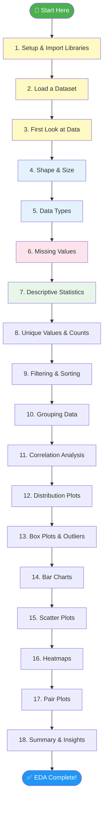

---

## 📦 Concept 1 — Setup & Import Libraries

### What & Why
Before doing any analysis, you need the right tools. Python has a rich ecosystem of libraries specifically for data analysis and visualization.

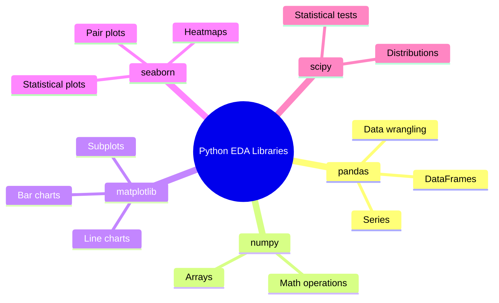

### Code Example

```python
# ─── Install (run once in terminal) ───
# pip install pandas numpy matplotlib seaborn scipy

# ─── Import Libraries ───
import pandas as pd          # Data manipulation
import numpy as np           # Numerical computations
import matplotlib.pyplot as plt  # Base plotting
import seaborn as sns        # Statistical visualization
from scipy import stats      # Statistical functions

# ─── Visual Settings ───
sns.set_theme(style="whitegrid")   # Clean background
plt.rcParams["figure.figsize"] = (10, 6)  # Default plot size

print("✅ All libraries imported successfully!")
```

### 💡 Key Takeaway
> `pandas` is your primary tool for data manipulation. `matplotlib` and `seaborn` are your visualization toolkit. Always import them at the top of every EDA notebook.

---

## 📂 Concept 2 — Loading a Dataset

### What & Why
Data comes in many formats. Knowing how to load each format is your first real skill. `pandas` makes this straightforward with a consistent `read_*` function family.

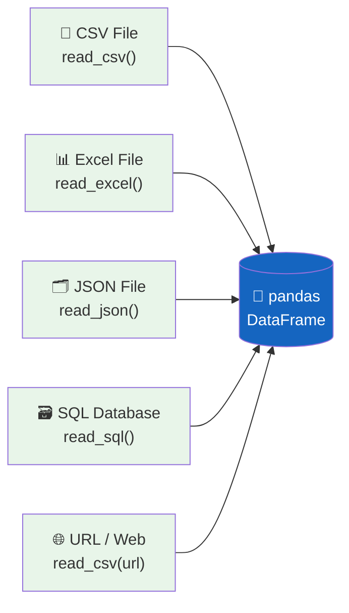

### Code Example

```python
# ─── Load from CSV ───
df = pd.read_csv("data.csv")

# ─── Load from URL (we'll use the famous Titanic dataset) ───
url = "https://raw.githubusercontent.com/datasciencedojo/datasets/master/titanic.csv"
df = pd.read_csv(url)

# ─── Load from Excel ───
# df = pd.read_excel("data.xlsx", sheet_name="Sheet1")

# ─── Load from JSON ───
# df = pd.read_json("data.json")

# ─── Using a built-in seaborn dataset (great for practice!) ───
df = sns.load_dataset("titanic")    # Famous Titanic survival dataset
# df = sns.load_dataset("iris")     # Classic flower measurements
# df = sns.load_dataset("tips")     # Restaurant tipping data

print(f"✅ Dataset loaded! Shape: {df.shape}")
```

### 💡 Key Takeaway
> For practice, use `sns.load_dataset()` — it gives you clean, real datasets instantly. For real projects, `pd.read_csv()` is the most common starting point.

---

## 👀 Concept 3 — First Look at the Data

### What & Why
The very first thing you should do after loading data is *look* at it. These four functions give you an immediate snapshot of what you're working with.

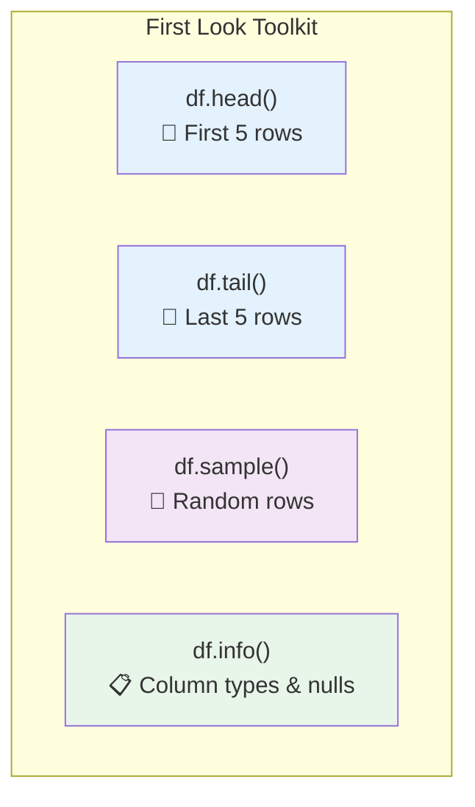

### Code Example

```python
df = sns.load_dataset("titanic")

# ─── See first 5 rows ───
print("=== FIRST 5 ROWS ===")
print(df.head())

# ─── See last 5 rows ───
print("\n=== LAST 5 ROWS ===")
print(df.tail())

# ─── See random 5 rows (great for spot-checking) ───
print("\n=== RANDOM 5 ROWS ===")
print(df.sample(5, random_state=42))

# ─── See column names, non-null counts, and data types ───
print("\n=== DATASET INFO ===")
df.info()

# Output of df.info() looks like:
# <class 'pandas.core.frame.DataFrame'>
# RangeIndex: 891 entries, 0 to 890
# Data columns (total 15 columns):
#  #   Column    Non-Null Count  Dtype
# ---  ------    --------------  -----
#  0   survived  891 non-null    int64
#  1   pclass    891 non-null    int64
#  2   sex       891 non-null    object
#  ...
```

### 💡 Key Takeaway
> `df.info()` is arguably the most important first command — it shows you column names, data types, and immediately flags missing values all at once.

---

## 📐 Concept 4 — Shape & Size of Data

### What & Why
Understanding how large your dataset is helps you plan your analysis and spot obvious issues (like a dataset that should have 1,000 rows but only has 50).

### Code Example

```python
df = sns.load_dataset("titanic")

# ─── Shape: (rows, columns) ───
print(f"Shape: {df.shape}")
# Output: Shape: (891, 15)

# ─── Number of rows ───
print(f"Rows: {df.shape[0]}")   # or len(df)

# ─── Number of columns ───
print(f"Columns: {df.shape[1]}")

# ─── Total cells ───
print(f"Total cells: {df.size}")

# ─── Column names ───
print(f"\nColumn names:\n{df.columns.tolist()}")

# ─── A nicely formatted summary ───
print(f"""
📊 Dataset Summary
━━━━━━━━━━━━━━━━━
  Rows      : {df.shape[0]:,}
  Columns   : {df.shape[1]:,}
  Total cells: {df.size:,}
""")
```

### 💡 Key Takeaway
> `df.shape` returns a tuple `(rows, columns)`. Always check this first — if the number looks wrong, your file might not have loaded correctly.

---

## 🏷️ Concept 5 — Data Types

### What & Why
Every column has a data type. Wrong data types are one of the most common sources of errors in analysis. For example, if a "Year" column is stored as text (`object`), you can't do math on it.

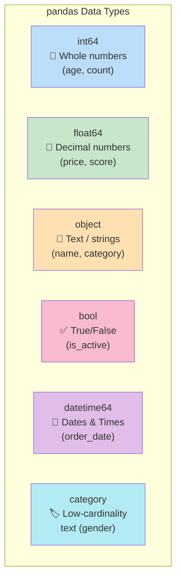

### Code Example

```python
df = sns.load_dataset("titanic")

# ─── Check all column types ───
print("Data Types:")
print(df.dtypes)

# ─── Count by type ───
print("\nType Counts:")
print(df.dtypes.value_counts())

# ─── Select only numeric columns ───
numeric_cols = df.select_dtypes(include=["number"])
print(f"\nNumeric columns: {numeric_cols.columns.tolist()}")

# ─── Select only text/categorical columns ───
text_cols = df.select_dtypes(include=["object", "category"])
print(f"Text columns: {text_cols.columns.tolist()}")

# ─── Fix wrong types: convert string to datetime ───
# df["date_col"] = pd.to_datetime(df["date_col"])

# ─── Fix wrong types: convert object to numeric ───
# df["price"] = pd.to_numeric(df["price"], errors="coerce")

# ─── Fix wrong types: convert to category (saves memory) ───
df["sex"] = df["sex"].astype("category")
print(f"\nMemory after category conversion: {df.memory_usage().sum() / 1024:.1f} KB")
```

### 💡 Key Takeaway
> `object` dtype means text or mixed content. If a column *should* be numeric, use `pd.to_numeric()`. If it should be a date, use `pd.to_datetime()`. Getting types right unlocks correct analysis.

---

## ❓ Concept 6 — Missing Values (Nulls)

### What & Why
Real-world data is almost always incomplete. Missing values (`NaN` — Not a Number) must be identified and handled before analysis, or they will silently corrupt your results.

```mermaid
flowchart TD
    A[Detect Missing Values\ndf.isnull().sum()] --> B{How many\nmissing?}
    B --> |"< 5% missing"| C[Drop rows\ndf.dropna()]
    B --> |"5–30% missing"| D[Fill / Impute\ndf.fillna()]
    B --> |"> 30% missing"| E[Drop the column\ndf.drop(columns=...)]
    
    D --> D1["Fill with mean\nfor numeric data"]
    D --> D2["Fill with mode\nfor categorical data"]
    D --> D3["Fill with 0, 'Unknown'\nfor known defaults"]

    style A fill:#E3F2FD
    style B fill:#FFF9C4
    style C fill:#E8F5E9
    style D fill:#E8F5E9
    style E fill:#FCE4EC
```

### Code Example

```python
df = sns.load_dataset("titanic")

# ─── Count missing values per column ───
print("Missing Values:")
print(df.isnull().sum())

# ─── As percentages (more useful!) ───
missing_pct = (df.isnull().sum() / len(df) * 100).round(2)
missing_pct = missing_pct[missing_pct > 0].sort_values(ascending=False)
print("\nMissing % (only columns with missing data):")
print(missing_pct)

# ─── Visualize missing values ───
import matplotlib.pyplot as plt

plt.figure(figsize=(10, 4))
missing_pct.plot(kind="bar", color="coral")
plt.title("Missing Values by Column (%)", fontsize=14, fontweight="bold")
plt.ylabel("Missing %")
plt.xticks(rotation=45)
plt.tight_layout()
plt.show()

# ─── Handle missing values ───

# Option 1: Drop rows where 'age' is missing
df_dropped = df.dropna(subset=["age"])
print(f"\nRows after dropping nulls in 'age': {len(df_dropped)}")

# Option 2: Fill numeric column with median (more robust than mean)
df["age"] = df["age"].fillna(df["age"].median())

# Option 3: Fill categorical column with mode (most frequent value)
df["embarked"] = df["embarked"].fillna(df["embarked"].mode()[0])

# Option 4: Drop a column with too many missing values (>40%)
df = df.drop(columns=["deck"])  # deck has 77% missing!

print("✅ Missing values handled!")
print(df.isnull().sum().sum(), "total nulls remaining")
```

### 💡 Key Takeaway
> Never ignore missing values. Always know *why* data is missing — it might be meaningful (e.g., no cabin = third class passenger in Titanic). Visualizing missingness makes patterns obvious.

---

## 📊 Concept 7 — Descriptive Statistics

### What & Why
Before plotting anything, run `.describe()` to get the core statistical summary of your numeric data in one command. This reveals the range, center, and spread of every column instantly.

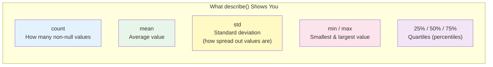

### Code Example

```python
df = sns.load_dataset("titanic")

# ─── Numeric columns summary ───
print("=== Numeric Statistics ===")
print(df.describe().round(2))

# ─── Text/categorical columns summary ───
print("\n=== Categorical Statistics ===")
print(df.describe(include=["object", "category"]))

# ─── All columns at once ───
print("\n=== All Columns ===")
print(df.describe(include="all"))

# ─── Individual statistics ───
print(f"\nMean age: {df['age'].mean():.1f}")
print(f"Median age: {df['age'].median():.1f}")
print(f"Mode of class: {df['pclass'].mode()[0]}")
print(f"Std of fare: {df['fare'].std():.2f}")
print(f"Age range: {df['age'].min():.0f} to {df['age'].max():.0f}")

# ─── Custom percentiles ───
print("\nAge percentiles:")
print(df["age"].quantile([0.1, 0.25, 0.5, 0.75, 0.9]))
```

### 💡 Key Takeaway
> When `mean` and `median` are very different, your data is skewed (not symmetric). Large `std` means values are spread far from the mean. These two clues guide your next steps.

---

## 🔢 Concept 8 — Unique Values & Value Counts

### What & Why
For categorical columns (like "gender", "city", "status"), you want to know: *what are the distinct values, and how often does each appear?* This is your first look at the distribution of categories.

### Code Example

```python
df = sns.load_dataset("titanic")

# ─── How many unique values in each column ───
print("Unique value counts per column:")
print(df.nunique().sort_values())

# ─── See the unique values themselves ───
print(f"\nUnique values in 'sex': {df['sex'].unique()}")
print(f"Unique values in 'pclass': {df['pclass'].unique()}")
print(f"Unique values in 'embarked': {df['embarked'].unique()}")

# ─── Count occurrences of each value ───
print("\nSurvived counts:")
print(df["survived"].value_counts())

print("\nClass distribution:")
print(df["pclass"].value_counts())

# ─── As percentages ───
print("\nGender distribution (%):")
print(df["sex"].value_counts(normalize=True).mul(100).round(1))

# ─── Visualize ───
fig, axes = plt.subplots(1, 2, figsize=(12, 4))

df["pclass"].value_counts().plot(kind="bar", ax=axes[0], 
                                  color=["#4e79a7","#f28e2b","#e15759"])
axes[0].set_title("Passenger Class Distribution", fontweight="bold")
axes[0].set_xlabel("Class")
axes[0].set_ylabel("Count")
axes[0].tick_params(axis="x", rotation=0)

df["embarked"].value_counts().plot(kind="pie", ax=axes[1], 
                                    autopct="%1.1f%%", startangle=90)
axes[1].set_title("Port of Embarkation", fontweight="bold")

plt.tight_layout()
plt.show()
```

### 💡 Key Takeaway
> `value_counts()` is one of the most frequently used EDA functions. Always use `normalize=True` to see proportions — knowing "80% are female" is more useful than knowing "643 are female" in most contexts.

---

## 🔍 Concept 9 — Filtering & Sorting

### What & Why
Real EDA involves investigating specific subsets: "show me only first-class passengers" or "who are the top 10 highest-paying customers?" Filtering and sorting are essential for targeted exploration.

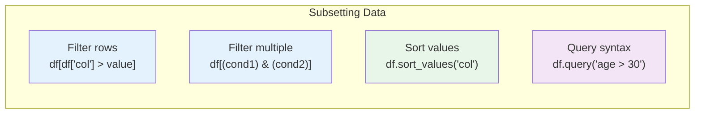

### Code Example

```python
df = sns.load_dataset("titanic")

# ─── Filter: single condition ───
adults = df[df["age"] >= 18]
print(f"Adult passengers: {len(adults)}")

# ─── Filter: multiple conditions ───
first_class_survivors = df[(df["pclass"] == 1) & (df["survived"] == 1)]
print(f"1st class survivors: {len(first_class_survivors)}")

# ─── OR condition ───
port_c_or_q = df[(df["embarked"] == "C") | (df["embarked"] == "Q")]
print(f"Embarked at C or Q: {len(port_c_or_q)}")

# ─── Filter using isin() for multiple values ───
rich_passengers = df[df["pclass"].isin([1, 2])]
print(f"1st or 2nd class: {len(rich_passengers)}")

# ─── Query syntax (more readable) ───
young_males = df.query("age < 20 and sex == 'male'")
print(f"Young males (under 20): {len(young_males)}")

# ─── Sort by a column ───
print("\nTop 5 highest fares:")
print(df.sort_values("fare", ascending=False)[["name", "fare", "pclass"]].head())

# ─── Sort by multiple columns ───
print("\nSorted by class then fare:")
print(df.sort_values(["pclass", "fare"], ascending=[True, False])[
    ["pclass", "fare", "survived"]
].head(8))
```

### 💡 Key Takeaway
> Always use parentheses around each condition when combining with `&` (AND) or `|` (OR). `.query()` is cleaner to read for complex filters.

---

## 📦 Concept 10 — Grouping & Aggregating

### What & Why
Grouping lets you answer questions like: *"What's the average survival rate by passenger class?"* or *"What's the total revenue by region?"* It's one of the most powerful EDA patterns.

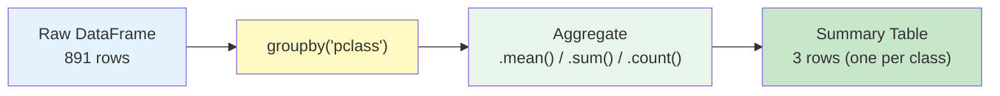

### Code Example

```python
df = sns.load_dataset("titanic")

# ─── Basic groupby + aggregation ───
print("Survival rate by class:")
print(df.groupby("pclass")["survived"].mean().round(3))

# ─── Multiple aggregations at once ───
print("\nAge statistics by gender:")
print(df.groupby("sex")["age"].agg(["mean", "median", "min", "max"]).round(1))

# ─── Group by multiple columns ───
print("\nSurvival by class AND gender:")
print(df.groupby(["pclass", "sex"])["survived"].mean().round(3).unstack())

# ─── agg with a dictionary (different function per column) ───
print("\nCustom aggregations:")
summary = df.groupby("pclass").agg(
    total_passengers=("survived", "count"),
    survivors=("survived", "sum"),
    avg_age=("age", "mean"),
    avg_fare=("fare", "mean")
).round(2)
print(summary)

# ─── Visualize survival rate by class ───
survival_by_class = df.groupby("pclass")["survived"].mean() * 100

plt.figure(figsize=(8, 5))
bars = plt.bar(["1st Class", "2nd Class", "3rd Class"], 
               survival_by_class.values,
               color=["#4CAF50", "#2196F3", "#f44336"])
plt.title("Survival Rate by Passenger Class", fontsize=14, fontweight="bold")
plt.ylabel("Survival Rate (%)")
for bar, val in zip(bars, survival_by_class.values):
    plt.text(bar.get_x() + bar.get_width()/2, bar.get_height() + 1,
             f"{val:.1f}%", ha="center", fontweight="bold")
plt.show()
```

### 💡 Key Takeaway
> `groupby` + `agg` is the backbone of summary analysis. Think of it as Excel's PivotTable — but programmatic, reproducible, and far more powerful.

---

## 🔗 Concept 11 — Correlation Analysis

### What & Why
Correlation measures how strongly two numeric variables move together. A correlation of +1 means they increase together; -1 means one increases as the other decreases; 0 means no relationship.

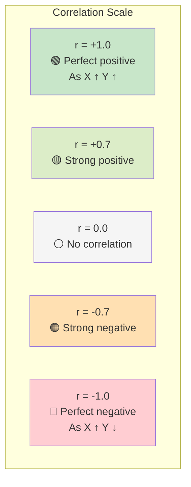

### Code Example

```python
df = sns.load_dataset("titanic")

# ─── Select numeric columns only ───
numeric_df = df.select_dtypes(include="number")

# ─── Correlation matrix ───
corr_matrix = numeric_df.corr()
print("Correlation Matrix:")
print(corr_matrix.round(2))

# ─── Correlation of ONE column with all others ───
print("\nCorrelation with 'survived':")
print(numeric_df.corr()["survived"].sort_values(ascending=False).round(3))

# ─── Heatmap of correlations ───
plt.figure(figsize=(9, 7))
sns.heatmap(
    corr_matrix,
    annot=True,          # Show numbers in cells
    fmt=".2f",           # 2 decimal places
    cmap="RdYlGn",       # Red=negative, Green=positive
    center=0,            # Center color at 0
    vmin=-1, vmax=1,     # Fixed scale
    square=True,
    linewidths=0.5
)
plt.title("Correlation Heatmap", fontsize=14, fontweight="bold")
plt.tight_layout()
plt.show()
```

### 💡 Key Takeaway
> Correlation does NOT mean causation. A strong correlation is a clue worth investigating further, not a conclusion. Always look at the scatter plot alongside the correlation number.

---

## 📈 Concept 12 — Distribution Plots (Histograms & KDE)

### What & Why
A distribution plot shows you *how your data is spread out*. Is it symmetric? Skewed left or right? Are there multiple peaks? This is fundamental to understanding any numeric variable.

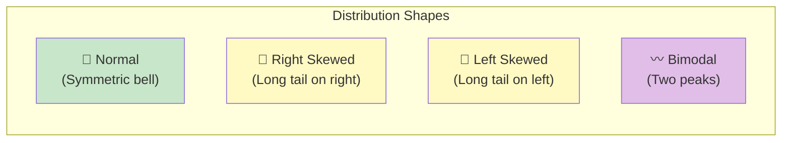

### Code Example

```python
df = sns.load_dataset("titanic")

fig, axes = plt.subplots(2, 2, figsize=(13, 10))

# ─── Basic histogram ───
axes[0, 0].hist(df["age"].dropna(), bins=30, color="#4e79a7", edgecolor="white")
axes[0, 0].set_title("Age Distribution (Histogram)", fontweight="bold")
axes[0, 0].set_xlabel("Age")
axes[0, 0].set_ylabel("Count")

# ─── KDE (Kernel Density Estimate) — smoothed histogram ───
sns.kdeplot(data=df, x="age", ax=axes[0, 1], fill=True, color="#f28e2b")
axes[0, 1].set_title("Age Distribution (KDE / Density)", fontweight="bold")
axes[0, 1].set_xlabel("Age")

# ─── Histogram + KDE combined ───
sns.histplot(data=df, x="fare", kde=True, ax=axes[1, 0],
             color="#e15759", bins=40)
axes[1, 0].set_title("Fare Distribution (Histogram + KDE)", fontweight="bold")
axes[1, 0].set_xlabel("Fare (£)")

# ─── Compare distributions by group ───
sns.kdeplot(data=df, x="age", hue="sex", ax=axes[1, 1], fill=True, alpha=0.4)
axes[1, 1].set_title("Age Distribution by Gender", fontweight="bold")
axes[1, 1].set_xlabel("Age")

plt.suptitle("Distribution Analysis", fontsize=16, fontweight="bold", y=1.01)
plt.tight_layout()
plt.show()

# ─── Check skewness ───
print(f"Age skewness: {df['age'].skew():.2f}  (0 = symmetric, >0 = right skew)")
print(f"Fare skewness: {df['fare'].skew():.2f}")
```

### 💡 Key Takeaway
> Skewness above 1 or below -1 is considered highly skewed. Skewed distributions often need transformation (like log) before modeling. The KDE is better for comparing multiple groups.

---

## 📦 Concept 13 — Box Plots & Outlier Detection

### What & Why
A box plot is the most compact way to visualize a distribution. It shows the median, spread (IQR), and outliers all in one chart. Outliers are data points that sit far from the bulk of the data.

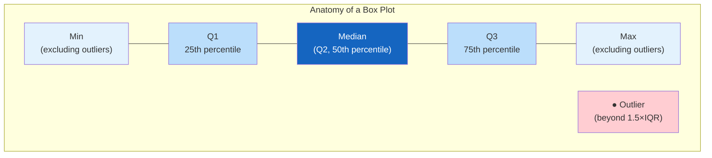

### Code Example

```python
df = sns.load_dataset("titanic")

fig, axes = plt.subplots(1, 3, figsize=(15, 6))

# ─── Simple box plot ───
sns.boxplot(data=df, y="age", ax=axes[0], color="#4e79a7")
axes[0].set_title("Age Distribution", fontweight="bold")

# ─── Box plot grouped by category ───
sns.boxplot(data=df, x="pclass", y="fare", ax=axes[1],
            palette=["#4CAF50", "#2196F3", "#f44336"])
axes[1].set_title("Fare by Class", fontweight="bold")
axes[1].set_xlabel("Passenger Class")

# ─── Violin plot (box plot + distribution shape) ───
sns.violinplot(data=df, x="sex", y="age", hue="survived",
               split=True, ax=axes[2], palette="Set2")
axes[2].set_title("Age by Gender & Survival", fontweight="bold")

plt.tight_layout()
plt.show()

# ─── Detect outliers using IQR method ───
Q1 = df["fare"].quantile(0.25)
Q3 = df["fare"].quantile(0.75)
IQR = Q3 - Q1

lower_bound = Q1 - 1.5 * IQR
upper_bound = Q3 + 1.5 * IQR

outliers = df[(df["fare"] < lower_bound) | (df["fare"] > upper_bound)]
print(f"Outlier count in 'fare': {len(outliers)} ({len(outliers)/len(df)*100:.1f}%)")
print(f"Fare bounds: {lower_bound:.2f} to {upper_bound:.2f}")
```

### 💡 Key Takeaway
> The **IQR (Interquartile Range)** = Q3 - Q1. Any point more than 1.5×IQR beyond Q1 or Q3 is flagged as an outlier. Outliers aren't always errors — sometimes they're the most interesting data points.

---

## 📊 Concept 14 — Bar Charts for Categorical Data

### What & Why
Bar charts compare quantities across categories. They're the go-to visualization for any categorical variable — showing counts, averages, or percentages across groups.

### Code Example

```python
df = sns.load_dataset("titanic")

fig, axes = plt.subplots(2, 2, figsize=(14, 10))

# ─── Simple count bar chart ───
sns.countplot(data=df, x="pclass", ax=axes[0, 0],
              palette=["#4e79a7", "#f28e2b", "#e15759"])
axes[0, 0].set_title("Count by Passenger Class", fontweight="bold")
axes[0, 0].set_xlabel("Class")

# ─── Horizontal bar chart ───
embarked_counts = df["embarked"].value_counts()
axes[0, 1].barh(embarked_counts.index, embarked_counts.values,
                color=["#59a14f", "#edc948", "#b07aa1"])
axes[0, 1].set_title("Passengers by Embarkation Port", fontweight="bold")
axes[0, 1].set_xlabel("Count")

# ─── Grouped bar chart ───
sns.countplot(data=df, x="pclass", hue="survived", ax=axes[1, 0],
              palette=["#e15759", "#59a14f"])
axes[1, 0].set_title("Survived vs Not by Class", fontweight="bold")
axes[1, 0].legend(title="Survived", labels=["No", "Yes"])

# ─── Stacked bar chart (shows proportions) ───
survival_pct = df.groupby("pclass")["survived"].value_counts(normalize=True).unstack()
survival_pct.plot(kind="bar", stacked=True, ax=axes[1, 1],
                  color=["#e15759", "#59a14f"])
axes[1, 1].set_title("Survival Rate by Class (Stacked %)", fontweight="bold")
axes[1, 1].set_xlabel("Class")
axes[1, 1].set_ylabel("Proportion")
axes[1, 1].legend(title="Survived", labels=["No", "Yes"])
axes[1, 1].tick_params(axis="x", rotation=0)

plt.suptitle("Categorical Analysis with Bar Charts", fontsize=15, fontweight="bold")
plt.tight_layout()
plt.show()
```

### 💡 Key Takeaway
> Use **grouped bars** to compare two categories side by side. Use **stacked bars** to show proportions. Use **horizontal bars** when category labels are long — they're easier to read.

---

## 🔵 Concept 15 — Scatter Plots (Relationship Between 2 Variables)

### What & Why
Scatter plots reveal the relationship between two numeric variables. Do they move together? Is the relationship linear or curved? Are there clusters or gaps? These patterns are invisible in tables.

### Code Example

```python
df = sns.load_dataset("titanic")

fig, axes = plt.subplots(1, 3, figsize=(16, 5))

# ─── Basic scatter ───
axes[0].scatter(df["age"], df["fare"], alpha=0.4, color="#4e79a7", edgecolors="white")
axes[0].set_title("Age vs Fare", fontweight="bold")
axes[0].set_xlabel("Age")
axes[0].set_ylabel("Fare (£)")

# ─── Scatter with color encoding ───
colors = df["survived"].map({0: "#e15759", 1: "#59a14f"})
scatter = axes[1].scatter(df["age"], df["fare"], c=colors, alpha=0.5, edgecolors="white")
axes[1].set_title("Age vs Fare (colored by Survival)", fontweight="bold")
axes[1].set_xlabel("Age")
axes[1].set_ylabel("Fare (£)")
from matplotlib.patches import Patch
legend_elements = [Patch(facecolor='#e15759', label='Did not survive'),
                   Patch(facecolor='#59a14f', label='Survived')]
axes[1].legend(handles=legend_elements)

# ─── seaborn scatter with regression line ───
sns.regplot(data=df, x="age", y="fare", ax=axes[2],
            scatter_kws={"alpha": 0.3, "color": "#f28e2b"},
            line_kws={"color": "#1a1a1a", "linewidth": 2})
axes[2].set_title("Age vs Fare (with trend line)", fontweight="bold")
axes[2].set_xlabel("Age")
axes[2].set_ylabel("Fare (£)")

plt.tight_layout()
plt.show()

# ─── More advanced: scatterplot with size encoding ───
plt.figure(figsize=(9, 6))
sns.scatterplot(data=df, x="age", y="fare", 
                hue="sex", size="pclass", 
                sizes=(30, 200), alpha=0.6, palette="deep")
plt.title("Age vs Fare (Hue=Gender, Size=Class)", fontsize=13, fontweight="bold")
plt.show()
```

### 💡 Key Takeaway
> Encoding a third variable with **color** and a fourth with **size** turns a 2D scatter plot into a 4-dimensional visualization. Don't use size for more than one variable — it becomes confusing quickly.

---

## 🌡️ Concept 16 — Heatmaps

### What & Why
Heatmaps encode numeric values as colors in a 2D grid. They're perfect for visualizing correlation matrices, pivot tables, or any data that forms a "grid" of values.

### Code Example

```python
df = sns.load_dataset("titanic")

fig, axes = plt.subplots(1, 2, figsize=(16, 6))

# ─── Correlation heatmap ───
corr = df.select_dtypes("number").corr()

sns.heatmap(
    corr,
    annot=True,
    fmt=".2f",
    cmap="coolwarm",
    center=0,
    vmin=-1, vmax=1,
    ax=axes[0],
    linewidths=0.5,
    annot_kws={"size": 10}
)
axes[0].set_title("Correlation Heatmap", fontweight="bold", fontsize=13)

# ─── Pivot table heatmap ───
pivot = df.pivot_table(
    values="survived",
    index="pclass",
    columns="sex",
    aggfunc="mean"
)

sns.heatmap(
    pivot,
    annot=True,
    fmt=".2f",
    cmap="RdYlGn",
    vmin=0, vmax=1,
    ax=axes[1],
    linewidths=1,
    annot_kws={"size": 14, "weight": "bold"}
)
axes[1].set_title("Survival Rate by Class & Gender", fontweight="bold", fontsize=13)
axes[1].set_xlabel("Gender")
axes[1].set_ylabel("Passenger Class")

plt.tight_layout()
plt.show()

# ─── Monthly activity heatmap (example pattern) ───
# Useful for time-series data
np.random.seed(42)
activity = pd.DataFrame(
    np.random.randint(0, 100, size=(7, 12)),
    index=["Mon","Tue","Wed","Thu","Fri","Sat","Sun"],
    columns=["Jan","Feb","Mar","Apr","May","Jun","Jul","Aug","Sep","Oct","Nov","Dec"]
)

plt.figure(figsize=(12, 4))
sns.heatmap(activity, annot=True, fmt="d", cmap="YlOrRd", linewidths=0.5)
plt.title("Example: Weekly Activity by Month", fontweight="bold")
plt.tight_layout()
plt.show()
```

### 💡 Key Takeaway
> Choose your colormap carefully. `coolwarm` or `RdYlGn` for diverging data (values that go both positive and negative). `YlOrRd` or `Blues` for sequential data (values that only go up).

---

## 🔢 Concept 17 — Pair Plots

### What & Why
A pair plot (scatter matrix) shows scatter plots for every pair of numeric variables simultaneously, plus the distribution of each variable on the diagonal. It gives you a "bird's eye view" of all relationships in one shot.

### Code Example

```python
df = sns.load_dataset("titanic")

# ─── Select relevant numeric columns ───
cols = ["survived", "pclass", "age", "sibsp", "parch", "fare"]
df_num = df[cols].dropna()

# ─── Basic pair plot ───
pair_plot = sns.pairplot(df_num, diag_kind="kde")
pair_plot.fig.suptitle("Pair Plot — Titanic Numeric Variables", 
                        y=1.01, fontsize=14, fontweight="bold")
plt.show()

# ─── Pair plot with color by survival ───
pair_plot2 = sns.pairplot(
    df_num,
    hue="survived",
    diag_kind="kde",
    palette={0: "#e15759", 1: "#59a14f"},
    plot_kws={"alpha": 0.4},
    corner=True      # Only lower triangle (avoids redundancy)
)
pair_plot2.fig.suptitle("Pair Plot by Survival Status", 
                          y=1.01, fontsize=14, fontweight="bold")
# Add legend
from matplotlib.patches import Patch
legend_elements = [Patch(facecolor='#e15759', label='Did not survive'),
                   Patch(facecolor='#59a14f', label='Survived')]
pair_plot2.fig.legend(handles=legend_elements, loc="upper right", fontsize=11)
plt.show()

# ─── For the iris dataset (classic pair plot example) ───
iris = sns.load_dataset("iris")
sns.pairplot(iris, hue="species", diag_kind="hist", palette="husl")
plt.suptitle("Iris Dataset — Pair Plot by Species", y=1.01, fontweight="bold")
plt.show()
```

### 💡 Key Takeaway
> Pair plots become slow and cluttered with more than 6–7 variables. For large datasets, use a correlation heatmap first to identify the most interesting pairs, then create individual scatter plots for those.

---

## ✅ Concept 18 — Putting It All Together: EDA Checklist & Report

### The Complete EDA Workflow

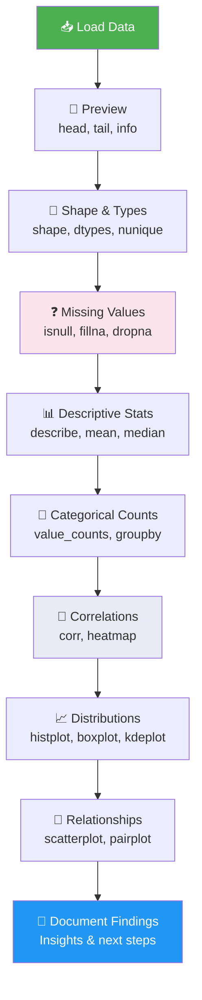

### Code Example — Complete EDA in One Function

```python
def quick_eda(df, target_col=None):
    """
    Automated EDA report for any DataFrame.
    
    Parameters:
        df (pd.DataFrame): The dataset to analyze
        target_col (str): Optional target/outcome column
    """
    print("=" * 60)
    print("📊  EXPLORATORY DATA ANALYSIS REPORT")
    print("=" * 60)
    
    # 1. Basic Info
    print(f"\n📐 Shape: {df.shape[0]:,} rows × {df.shape[1]} columns")
    print(f"💾 Memory: {df.memory_usage(deep=True).sum() / 1024:.1f} KB")
    
    # 2. Data Types
    print(f"\n🏷️  Data Types:")
    for dtype, count in df.dtypes.value_counts().items():
        print(f"   {str(dtype):<12}: {count} columns")
    
    # 3. Missing Values
    missing = df.isnull().sum()
    missing_cols = missing[missing > 0]
    print(f"\n❓ Missing Values:")
    if len(missing_cols) == 0:
        print("   ✅ No missing values!")
    else:
        for col, count in missing_cols.items():
            pct = count / len(df) * 100
            print(f"   {col:<20}: {count:>4} ({pct:.1f}%)")
    
    # 4. Duplicates
    dup_count = df.duplicated().sum()
    print(f"\n👯 Duplicate rows: {dup_count}")
    
    # 5. Numeric Summary
    numeric_cols = df.select_dtypes("number").columns
    if len(numeric_cols) > 0:
        print(f"\n📈 Numeric Columns ({len(numeric_cols)}):")
        print(df[numeric_cols].describe().round(2))
    
    # 6. Categorical Summary
    cat_cols = df.select_dtypes(["object", "category"]).columns
    if len(cat_cols) > 0:
        print(f"\n📝 Categorical Columns ({len(cat_cols)}):")
        for col in cat_cols:
            n_unique = df[col].nunique()
            top_val = df[col].value_counts().index[0]
            top_pct = df[col].value_counts(normalize=True).iloc[0] * 100
            print(f"   {col:<20}: {n_unique} unique | "
                  f"Top: '{top_val}' ({top_pct:.1f}%)")
    
    # 7. Target Analysis
    if target_col and target_col in df.columns:
        print(f"\n🎯 Target Column: '{target_col}'")
        print(df[target_col].value_counts(normalize=True).mul(100).round(1))
    
    print("\n" + "=" * 60)
    print("✅ EDA Complete! Review findings above.")
    print("=" * 60)


# ─── Run it! ───
df = sns.load_dataset("titanic")
quick_eda(df, target_col="survived")
```

### 🗺️ Quick Reference Card

```mermaid
mindmap
  root((EDA Cheatsheet))
    Load & Preview
      pd.read_csv()
      df.head()
      df.info()
      df.shape
    Data Quality
      df.isnull().sum()
      df.duplicated()
      df.dtypes
      df.nunique()
    Statistics
      df.describe()
      df.mean() / median()
      df.value_counts()
      df.corr()
    Visualizations
      sns.histplot()
      sns.boxplot()
      sns.heatmap()
      sns.pairplot()
      sns.countplot()
      sns.scatterplot()
    Manipulation
      df.groupby()
      df.sort_values()
      df.dropna()
      df.fillna()
      df.query()
```

---

## 📚 Summary Table — All 18 Concepts

| # | Concept | Key Function | Chart Type |
|---|---------|-------------|-----------|
| 1 | Setup & Libraries | `import pandas as pd` | — |
| 2 | Loading Data | `pd.read_csv()` | — |
| 3 | First Look | `df.head()`, `df.info()` | — |
| 4 | Shape & Size | `df.shape` | — |
| 5 | Data Types | `df.dtypes` | — |
| 6 | Missing Values | `df.isnull().sum()` | Bar chart |
| 7 | Descriptive Stats | `df.describe()` | — |
| 8 | Value Counts | `df.value_counts()` | Bar / Pie |
| 9 | Filtering & Sorting | `df[df['col'] > x]` | — |
| 10 | Grouping | `df.groupby().agg()` | Bar chart |
| 11 | Correlation | `df.corr()` | Heatmap |
| 12 | Distributions | `sns.histplot()` | Histogram / KDE |
| 13 | Box Plots | `sns.boxplot()` | Box / Violin |
| 14 | Bar Charts | `sns.countplot()` | Bar (stacked/grouped) |
| 15 | Scatter Plots | `sns.scatterplot()` | Scatter |
| 16 | Heatmaps | `sns.heatmap()` | Heatmap |
| 17 | Pair Plots | `sns.pairplot()` | Matrix |
| 18 | Full EDA Pipeline | `quick_eda(df)` | Multiple |

---

## 🚀 Practice Datasets

Use these free datasets to practice all 18 concepts:

```python
import seaborn as sns

# Classic beginner datasets
titanic = sns.load_dataset("titanic")     # Survival prediction
iris = sns.load_dataset("iris")           # Flower classification
tips = sns.load_dataset("tips")           # Restaurant tips regression
penguins = sns.load_dataset("penguins")  # Penguin species classification
diamonds = sns.load_dataset("diamonds")  # Gem pricing

# From sklearn
from sklearn.datasets import load_iris, load_diabetes, fetch_california_housing
```

---

*📘 This guide covers the essential 80% of EDA that applies to almost every real-world dataset. Practice with different datasets, and EDA will become second nature.*
