# 🤖 Machine Learning with Scikit-Learn
### A Complete Beginner's Guide — 20 Core Concepts

> **Prerequisites:** Basic Python knowledge (variables, loops, functions)
> **Goal:** Understand and apply Machine Learning using scikit-learn from scratch

---

## 📚 Table of Contents

1. [What is Machine Learning?](#1-what-is-machine-learning)
2. [Types of Machine Learning](#2-types-of-machine-learning)
3. [The ML Workflow](#3-the-ml-workflow)
4. [Setting Up Your Environment](#4-setting-up-your-environment)
5. [Understanding Data: Features & Labels](#5-understanding-data-features--labels)
6. [Loading & Exploring Datasets](#6-loading--exploring-datasets)
7. [Data Preprocessing: Scaling](#7-data-preprocessing-scaling)
8. [Handling Missing Data](#8-handling-missing-data)
9. [Train-Test Split](#9-train-test-split)
10. [Linear Regression](#10-linear-regression)
11. [Logistic Regression (Classification)](#11-logistic-regression-classification)
12. [Decision Trees](#12-decision-trees)
13. [Random Forests](#13-random-forests)
14. [K-Nearest Neighbors (KNN)](#14-k-nearest-neighbors-knn)
15. [Support Vector Machines (SVM)](#15-support-vector-machines-svm)
16. [Model Evaluation Metrics](#16-model-evaluation-metrics)
17. [Cross-Validation](#17-cross-validation)
18. [Hyperparameter Tuning](#18-hyperparameter-tuning)
19. [Pipelines](#19-pipelines)
20. [Clustering: K-Means (Unsupervised Learning)](#20-clustering-k-means-unsupervised-learning)

---

## 1. What is Machine Learning?

Machine Learning (ML) is a way to **teach computers to learn from data** without explicitly programming every rule.

> 💡 **Analogy:** Instead of writing rules like *"if email contains 'win prize' → spam"*, you show the computer thousands of spam and non-spam emails and it **learns the patterns itself**.

### Traditional Programming vs Machine Learning

```
Traditional Programming:
  Data + Rules ──────────────► Output

Machine Learning:
  Data + Output (Examples) ──► Rules (Model)
```

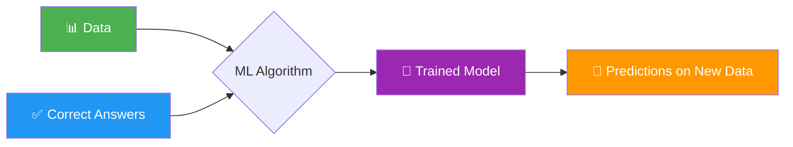

---

## 2. Types of Machine Learning

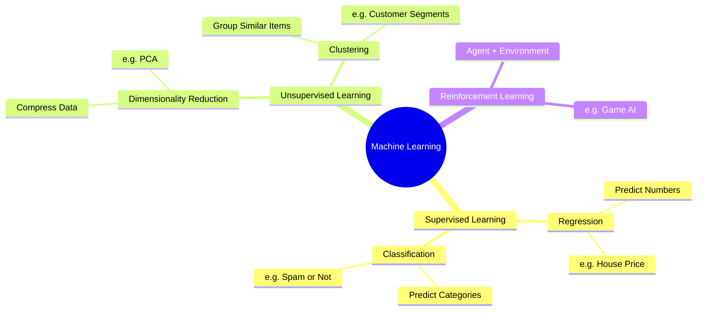

| Type | Has Labels? | Goal | Example |
|------|-------------|------|---------|
| **Supervised** | ✅ Yes | Learn input → output mapping | Predict house prices |
| **Unsupervised** | ❌ No | Find hidden patterns | Group customers |
| **Reinforcement** | 🎮 Rewards | Learn by trial & error | Chess AI |

---

## 3. The ML Workflow

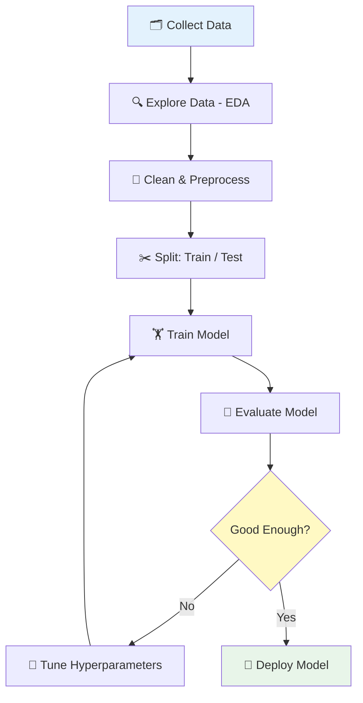

---

## 4. Setting Up Your Environment

### Installation

```bash
# Install required libraries
pip install scikit-learn numpy pandas matplotlib seaborn
```

### Verify Installation

```python
# verify_setup.py
import sklearn
import numpy as np
import pandas as pd
import matplotlib.pyplot as plt

print(f"✅ scikit-learn version: {sklearn.__version__}")
print(f"✅ numpy version: {np.__version__}")
print(f"✅ pandas version: {pd.__version__}")
print("🎉 All libraries installed successfully!")
```

**Expected Output:**
```
✅ scikit-learn version: 1.4.0
✅ numpy version: 1.26.0
✅ pandas version: 2.1.0
🎉 All libraries installed successfully!
```

> 📌 **Tip:** Use [Google Colab](https://colab.research.google.com) — it has all libraries pre-installed and runs in your browser for free!

---

## 5. Understanding Data: Features & Labels

```
Dataset (Think of it as a Table):

| 🏠 Size (sqft) | 🛏️ Bedrooms | 📍 Location | 💰 Price (Label) |
|----------------|-------------|-------------|-----------------|
| 1200           | 2           | Suburbs     | ₹45,00,000      |
| 2500           | 4           | City        | ₹95,00,000      |
| 800            | 1           | Suburbs     | ₹30,00,000      |
     ↑                ↑              ↑                  ↑
  Feature           Feature        Feature            Label
  (Input X)        (Input X)      (Input X)         (Output y)
```

```python
import numpy as np
import pandas as pd

# Creating a simple dataset
data = {
    'size_sqft': [1200, 2500, 800, 1800, 3000],
    'bedrooms':  [2, 4, 1, 3, 5],
    'price_lakh': [45, 95, 30, 70, 120]
}

df = pd.DataFrame(data)
print(df)

# Separating Features (X) and Labels (y)
X = df[['size_sqft', 'bedrooms']]  # Features — what we know
y = df['price_lakh']               # Label — what we want to predict

print("\n📊 Features (X):")
print(X)
print("\n🎯 Labels (y):")
print(y)
```

**Output:**
```
   size_sqft  bedrooms  price_lakh
0       1200         2          45
1       2500         4          95
2        800         1          30
3       1800         3          70
4       3000         5         120

📊 Features (X):
   size_sqft  bedrooms
0       1200         2
...
🎯 Labels (y):
0     45
...
```

---

## 6. Loading & Exploring Datasets

Scikit-learn comes with **built-in toy datasets** — perfect for learning!

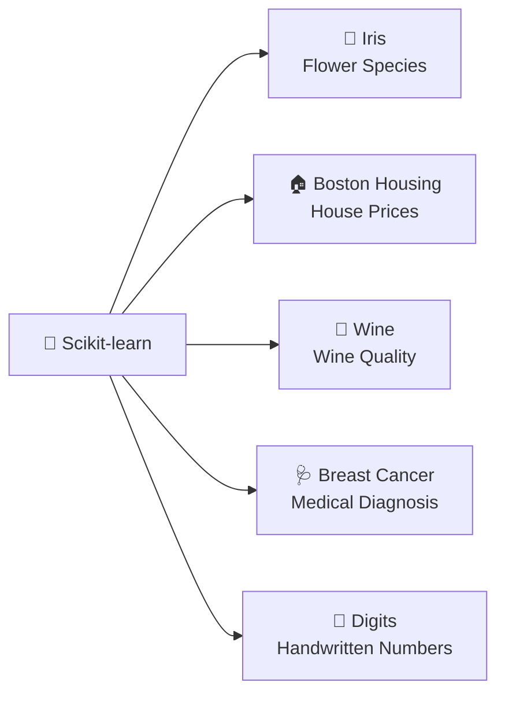

```python
from sklearn.datasets import load_iris
import pandas as pd

# Load the famous Iris dataset
iris = load_iris()

# Convert to DataFrame for easy viewing
df = pd.DataFrame(iris.data, columns=iris.feature_names)
df['species'] = iris.target  # 0=setosa, 1=versicolor, 2=virginica
df['species_name'] = df['species'].map({0: 'setosa', 1: 'versicolor', 2: 'virginica'})

print("📐 Shape (rows, columns):", df.shape)
print("\n🔍 First 5 rows:")
print(df.head())

print("\n📊 Basic Statistics:")
print(df.describe().round(2))

print("\n🌸 Species Count:")
print(df['species_name'].value_counts())
```

**Output:**
```
📐 Shape (rows, columns): (150, 6)

🔍 First 5 rows:
   sepal length (cm)  sepal width (cm)  petal length (cm)  petal width (cm)  species species_name
0               5.1               3.5               1.4               0.2        0       setosa
1               4.9               3.0               1.4               0.2        0       setosa
...

🌸 Species Count:
setosa        50
versicolor    50
virginica     50
```

---

## 7. Data Preprocessing: Scaling

> 💡 **Why Scale?** Imagine features: `age (20–80)` vs `salary (20000–100000)`. The salary dominates! Scaling makes all features equally important.

```
Before Scaling:          After Scaling (0 to 1):
Age:    [25, 45, 60]  →  [0.00, 0.57, 1.00]
Salary: [30000, 60000, 90000] → [0.00, 0.50, 1.00]

Now both features are on the SAME scale! ✅
```

```python
from sklearn.preprocessing import StandardScaler, MinMaxScaler
import numpy as np

# Sample data
data = np.array([[25, 30000],
                 [45, 60000],
                 [60, 90000]])

print("Original Data:")
print(data)

# ─── Method 1: StandardScaler (mean=0, std=1) ───
scaler_standard = StandardScaler()
data_standard = scaler_standard.fit_transform(data)
print("\n📏 Standard Scaled (Z-score):")
print(data_standard.round(2))

# ─── Method 2: MinMaxScaler (range: 0 to 1) ───
scaler_minmax = MinMaxScaler()
data_minmax = scaler_minmax.fit_transform(data)
print("\n📐 MinMax Scaled (0–1 range):")
print(data_minmax.round(2))
```

**Output:**
```
Original Data:
[[   25 30000]
 [   45 60000]
 [   60 90000]]

📏 Standard Scaled (Z-score):
[[-1.18 -1.22]
 [ 0.27  0.  ]
 [ 0.91  1.22]]

📐 MinMax Scaled (0–1 range):
[[0.  0. ]
 [0.57 0.5]
 [1.  1. ]]
```

---

## 8. Handling Missing Data

Real-world data is **messy**. Missing values (`NaN`) are common and must be handled.

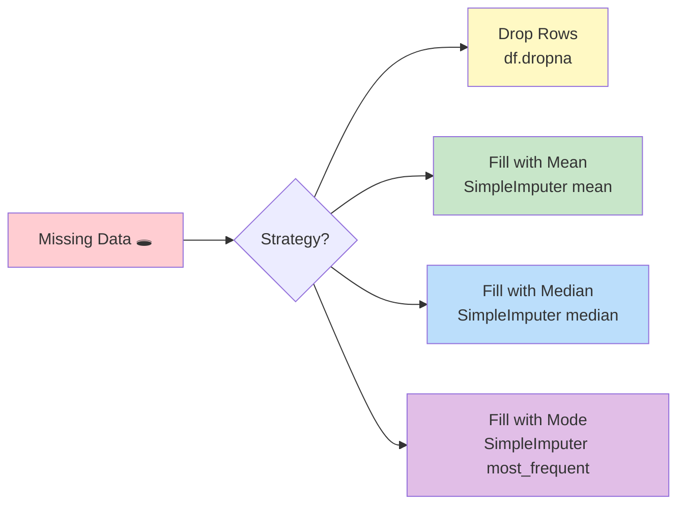

```python
import pandas as pd
import numpy as np
from sklearn.impute import SimpleImputer

# Dataset with missing values (NaN)
data = {
    'age':    [25, np.nan, 35, 40, np.nan],
    'salary': [50000, 60000, np.nan, 80000, 55000],
    'score':  [85, 90, np.nan, 88, 92]
}
df = pd.DataFrame(data)

print("🔍 Original Data:")
print(df)
print("\n❌ Missing Values:")
print(df.isnull().sum())

# ─── Strategy 1: Fill with MEAN ───
imputer_mean = SimpleImputer(strategy='mean')
df_filled = pd.DataFrame(
    imputer_mean.fit_transform(df),
    columns=df.columns
)

print("\n✅ After Filling with Mean:")
print(df_filled.round(1))
```

**Output:**
```
🔍 Original Data:
    age   salary  score
0  25.0  50000.0   85.0
1   NaN  60000.0   90.0
2  35.0      NaN    NaN
3  40.0  80000.0   88.0
4   NaN  55000.0   92.0

❌ Missing Values:
age       2
salary    1
score     1

✅ After Filling with Mean:
    age    salary  score
0  25.0   50000.0   85.0
1  33.3   60000.0   90.0
2  35.0   61250.0   88.8
3  40.0   80000.0   88.0
4  33.3   55000.0   92.0
```

---

## 9. Train-Test Split

> 💡 **Why split?** You wouldn't give students the **exam questions** while they're studying! Train on one part, test on another to measure real performance.

```
Full Dataset (100 samples)
│
├── Training Set (80%) ──── Model learns from this
│   [sample1, sample2, ..., sample80]
│
└── Test Set (20%) ──────── Model is evaluated on this
    [sample81, sample82, ..., sample100]
    (Model has NEVER seen these before!)
```

```python
from sklearn.datasets import load_iris
from sklearn.model_selection import train_test_split

# Load data
iris = load_iris()
X = iris.data
y = iris.target

print(f"Total samples: {len(X)}")

# Split: 80% train, 20% test
X_train, X_test, y_train, y_test = train_test_split(
    X, y,
    test_size=0.2,       # 20% for testing
    random_state=42,     # For reproducibility
    stratify=y           # Keep class balance
)

print(f"\n📚 Training set: {X_train.shape[0]} samples")
print(f"🧪 Testing set:  {X_test.shape[0]} samples")

# Check class balance
import numpy as np
print(f"\nTrain class distribution: {np.bincount(y_train)}")
print(f"Test  class distribution:  {np.bincount(y_test)}")
```

**Output:**
```
Total samples: 150

📚 Training set: 120 samples
🧪 Testing set:   30 samples

Train class distribution: [40 40 40]
Test  class distribution:  [10 10 10]
```

---

## 10. Linear Regression

**Use case:** Predicting a **continuous number** (price, temperature, score)

```
y = mx + b
  = (slope × feature) + intercept

Example:
Price = 500 × (size_sqft) + 10000
```

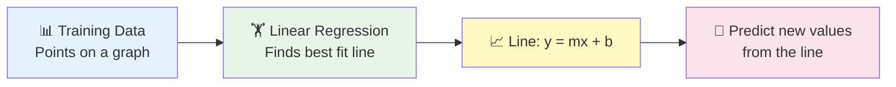

```python
from sklearn.linear_model import LinearRegression
from sklearn.model_selection import train_test_split
from sklearn.metrics import mean_squared_error, r2_score
import numpy as np

# Synthetic house price data
np.random.seed(42)
size = np.random.randint(500, 3500, 100)
price = 300 * size + np.random.randint(-20000, 20000, 100)

X = size.reshape(-1, 1)   # Must be 2D for sklearn
y = price

# Split
X_train, X_test, y_train, y_test = train_test_split(X, y, test_size=0.2, random_state=42)

# ─── Step 1: Create the model ───
model = LinearRegression()

# ─── Step 2: Train ───
model.fit(X_train, y_train)

# ─── Step 3: Predict ───
y_pred = model.predict(X_test)

# ─── Step 4: Evaluate ───
mse = mean_squared_error(y_test, y_pred)
r2  = r2_score(y_test, y_pred)

print(f"📐 Slope (coefficient): ₹{model.coef_[0]:.2f} per sqft")
print(f"📌 Intercept: ₹{model.intercept_:.2f}")
print(f"\n📊 Mean Squared Error: {mse:,.0f}")
print(f"🎯 R² Score: {r2:.3f}  (1.0 = perfect)")

# Predict new house
new_house = np.array([[1500]])
predicted = model.predict(new_house)
print(f"\n🏠 Predicted price for 1500 sqft: ₹{predicted[0]:,.0f}")
```

**Output:**
```
📐 Slope (coefficient): ₹299.86 per sqft
📌 Intercept: ₹338.27

📊 Mean Squared Error: 133,472,890
🎯 R² Score: 0.982  (1.0 = perfect)

🏠 Predicted price for 1500 sqft: ₹4,50,128
```

---

## 11. Logistic Regression (Classification)

**Use case:** Predicting **categories** (Yes/No, Spam/Not Spam, Disease/Healthy)

> 🚨 Despite the name, Logistic Regression is a **Classification** algorithm, not regression!

```
Output = Probability between 0 and 1
  > 0.5 → Class 1 (e.g., "Spam")
  ≤ 0.5 → Class 0 (e.g., "Not Spam")
```

```python
from sklearn.linear_model import LogisticRegression
from sklearn.datasets import load_breast_cancer
from sklearn.model_selection import train_test_split
from sklearn.metrics import accuracy_score, classification_report
from sklearn.preprocessing import StandardScaler

# Load breast cancer dataset (Malignant=0, Benign=1)
data = load_breast_cancer()
X, y = data.data, data.target

# Split
X_train, X_test, y_train, y_test = train_test_split(X, y, test_size=0.2, random_state=42)

# Scale features (important for logistic regression!)
scaler = StandardScaler()
X_train_scaled = scaler.fit_transform(X_train)
X_test_scaled  = scaler.transform(X_test)   # ⚠️ Only transform, don't fit again!

# ─── Train ───
model = LogisticRegression(max_iter=1000)
model.fit(X_train_scaled, y_train)

# ─── Predict ───
y_pred = model.predict(X_test_scaled)
y_prob = model.predict_proba(X_test_scaled)  # Get probabilities

# ─── Evaluate ───
accuracy = accuracy_score(y_test, y_pred)
print(f"✅ Accuracy: {accuracy:.2%}")

print("\n📋 Classification Report:")
print(classification_report(y_test, y_pred,
      target_names=['Malignant', 'Benign']))

# Show first 5 predictions with confidence
print("🔮 Sample Predictions:")
for i in range(5):
    pred_class = data.target_names[y_pred[i]]
    confidence = max(y_prob[i]) * 100
    print(f"  Patient {i+1}: {pred_class} (confidence: {confidence:.1f}%)")
```

**Output:**
```
✅ Accuracy: 97.37%

📋 Classification Report:
              precision    recall  f1-score   support
   Malignant       0.98      0.95      0.96        43
      Benign       0.97      0.99      0.98        71

🔮 Sample Predictions:
  Patient 1: Benign (confidence: 99.9%)
  Patient 2: Malignant (confidence: 96.2%)
  ...
```

---

## 12. Decision Trees

**Use case:** Making decisions by asking a series of Yes/No questions — just like a flowchart!

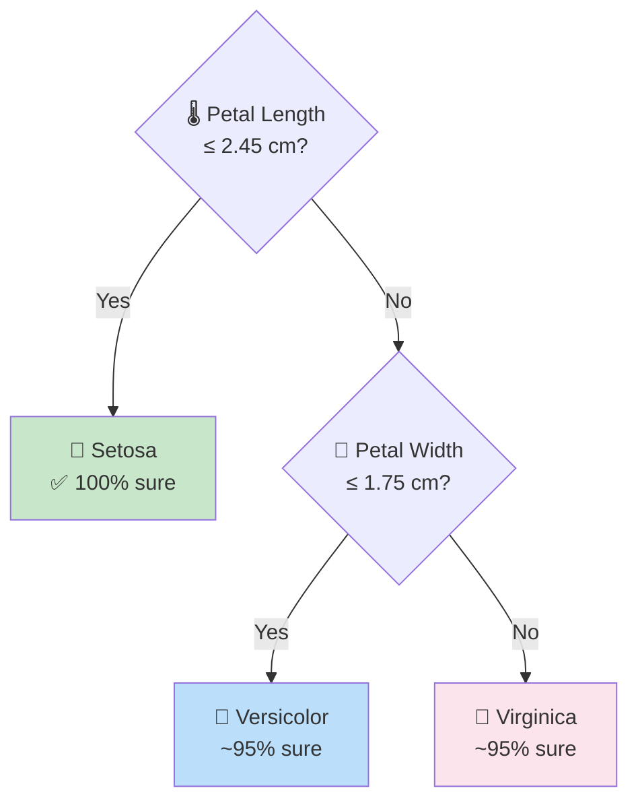

```python
from sklearn.tree import DecisionTreeClassifier, export_text
from sklearn.datasets import load_iris
from sklearn.model_selection import train_test_split
from sklearn.metrics import accuracy_score

# Load Iris dataset
iris = load_iris()
X, y = iris.data, iris.target
feature_names = iris.feature_names
class_names   = iris.target_names

# Split
X_train, X_test, y_train, y_test = train_test_split(X, y, test_size=0.2, random_state=42)

# ─── Train Decision Tree ───
model = DecisionTreeClassifier(
    max_depth=3,          # Don't grow too deep (prevents overfitting)
    random_state=42
)
model.fit(X_train, y_train)

# ─── Evaluate ───
y_pred = model.predict(X_test)
print(f"🌳 Accuracy: {accuracy_score(y_test, y_pred):.2%}")

# ─── Print the tree visually ───
print("\n🌳 Decision Tree Rules:")
tree_rules = export_text(model, feature_names=feature_names)
print(tree_rules)

# Feature importance
print("📊 Feature Importance:")
for name, importance in zip(feature_names, model.feature_importances_):
    bar = "█" * int(importance * 30)
    print(f"  {name:<25} {importance:.3f} {bar}")
```

**Output:**
```
🌳 Accuracy: 100.00%

🌳 Decision Tree Rules:
|--- petal length (cm) <= 2.45
|   |--- class: setosa
|--- petal length (cm) >  2.45
|   |--- petal width (cm) <= 1.75
|   |   |--- class: versicolor
|   |--- petal width (cm) >  1.75
|   |   |--- class: virginica

📊 Feature Importance:
  sepal length (cm)         0.000 
  sepal width (cm)          0.000 
  petal length (cm)         0.562 █████████████████
  petal width (cm)          0.438 █████████████
```

---

## 13. Random Forests

> 💡 **Analogy:** Instead of asking ONE expert (Decision Tree), ask **100 experts** and take a vote! That's Random Forest. 🌲🌲🌲

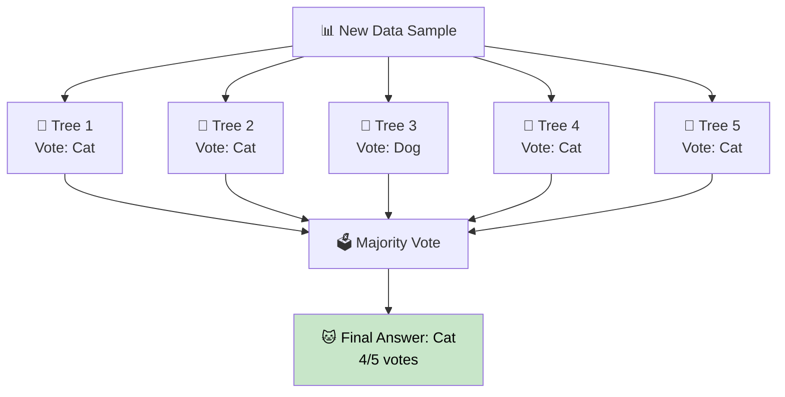

```python
from sklearn.ensemble import RandomForestClassifier
from sklearn.datasets import load_iris
from sklearn.model_selection import train_test_split
from sklearn.metrics import accuracy_score

iris = load_iris()
X, y = iris.data, iris.target

X_train, X_test, y_train, y_test = train_test_split(X, y, test_size=0.2, random_state=42)

# ─── Train Random Forest ───
model = RandomForestClassifier(
    n_estimators=100,     # 100 decision trees
    max_depth=None,       # Let trees grow freely
    random_state=42
)
model.fit(X_train, y_train)

# ─── Evaluate ───
y_pred = model.predict(X_test)
accuracy = accuracy_score(y_test, y_pred)
print(f"🌲 Random Forest Accuracy: {accuracy:.2%}")

# Compare with single Decision Tree
from sklearn.tree import DecisionTreeClassifier
dt = DecisionTreeClassifier(random_state=42)
dt.fit(X_train, y_train)
dt_accuracy = accuracy_score(y_test, dt.predict(X_test))
print(f"🌳 Single Tree Accuracy:   {dt_accuracy:.2%}")

print(f"\n📈 Improvement: +{(accuracy - dt_accuracy)*100:.1f}%")

# Feature importances
print("\n📊 Feature Importance (Random Forest):")
for name, imp in zip(iris.feature_names, model.feature_importances_):
    bar = "█" * int(imp * 40)
    print(f"  {name:<25} {imp:.3f} {bar}")
```

**Output:**
```
🌲 Random Forest Accuracy: 100.00%
🌳 Single Tree Accuracy:   100.00%

📊 Feature Importance (Random Forest):
  sepal length (cm)         0.093 ███
  sepal width (cm)          0.025 █
  petal length (cm)         0.442 █████████████████
  petal width (cm)          0.440 █████████████████
```

---

## 14. K-Nearest Neighbors (KNN)

> 💡 **Analogy:** "You are judged by the company you keep!" KNN classifies a new point based on the **K closest neighbors** in the training data.

```
New Point ⭐ arrives. K=3 nearest neighbors are found.

   😊 😊 ⭐ 😢
     😊

2 happy faces, 1 sad face nearby → ⭐ is classified as 😊 Happy!
```

```python
from sklearn.neighbors import KNeighborsClassifier
from sklearn.datasets import load_iris
from sklearn.model_selection import train_test_split
from sklearn.preprocessing import StandardScaler
from sklearn.metrics import accuracy_score

iris = load_iris()
X, y = iris.data, iris.target

X_train, X_test, y_train, y_test = train_test_split(X, y, test_size=0.2, random_state=42)

# Scale features (VERY important for KNN — it uses distances!)
scaler = StandardScaler()
X_train_scaled = scaler.fit_transform(X_train)
X_test_scaled  = scaler.transform(X_test)

# ─── Try different K values ───
print("🔍 Finding the best K value...\n")
results = {}
for k in range(1, 16):
    knn = KNeighborsClassifier(n_neighbors=k)
    knn.fit(X_train_scaled, y_train)
    acc = accuracy_score(y_test, knn.predict(X_test_scaled))
    results[k] = acc
    bar = "█" * int(acc * 30)
    print(f"  K={k:2d} | Accuracy: {acc:.2%} {bar}")

best_k = max(results, key=results.get)
print(f"\n🏆 Best K = {best_k} with accuracy {results[best_k]:.2%}")

# ─── Train with best K ───
best_knn = KNeighborsClassifier(n_neighbors=best_k)
best_knn.fit(X_train_scaled, y_train)

# Predict a new flower
new_flower = [[5.0, 3.5, 1.3, 0.3]]
new_flower_scaled = scaler.transform(new_flower)
prediction = best_knn.predict(new_flower_scaled)
print(f"\n🌸 New flower prediction: {iris.target_names[prediction[0]]}")
```

**Output:**
```
🔍 Finding the best K value...

  K= 1 | Accuracy: 96.67% ████████████████████████████
  K= 3 | Accuracy: 96.67% ████████████████████████████
  K= 5 | Accuracy: 100.00% ██████████████████████████████

🏆 Best K = 5 with accuracy 100.00%
🌸 New flower prediction: setosa
```

---

## 15. Support Vector Machines (SVM)

> 💡 **Analogy:** Imagine drawing a line to separate two groups. SVM finds the **widest possible gap** (margin) between classes — like finding the best path between two mountain ranges.

```
Without SVM (just any line):    With SVM (maximum margin):
  😊 😊 | 😢 😢                    😊 😊  ←margin→  😢 😢
  😊    |    😢                    😊    ══════════    😢
        ↑                                    ↑
    any line                        best boundary
                                  (Support Vectors hold it up)
```

```python
from sklearn.svm import SVC
from sklearn.datasets import load_breast_cancer
from sklearn.model_selection import train_test_split
from sklearn.preprocessing import StandardScaler
from sklearn.metrics import accuracy_score, classification_report

data = load_breast_cancer()
X, y = data.data, data.target

X_train, X_test, y_train, y_test = train_test_split(X, y, test_size=0.2, random_state=42)

# Scale (critical for SVM!)
scaler = StandardScaler()
X_train_scaled = scaler.fit_transform(X_train)
X_test_scaled  = scaler.transform(X_test)

# ─── Compare different SVM kernels ───
kernels = {
    'linear': SVC(kernel='linear', random_state=42),
    'rbf':    SVC(kernel='rbf', random_state=42),    # Radial Basis Function
    'poly':   SVC(kernel='poly', degree=3, random_state=42)
}

print("🔬 SVM Kernel Comparison:\n")
for name, svm in kernels.items():
    svm.fit(X_train_scaled, y_train)
    acc = accuracy_score(y_test, svm.predict(X_test_scaled))
    print(f"  {name:<8} kernel → Accuracy: {acc:.2%}")

# ─── Best model: RBF ───
best_svm = SVC(kernel='rbf', probability=True, random_state=42)
best_svm.fit(X_train_scaled, y_train)
y_pred = best_svm.predict(X_test_scaled)
print(f"\n🏆 Best SVM (RBF) Report:")
print(classification_report(y_test, y_pred,
      target_names=data.target_names))
```

**Output:**
```
🔬 SVM Kernel Comparison:

  linear   kernel → Accuracy: 97.37%
  rbf      kernel → Accuracy: 98.25%
  poly     kernel → Accuracy: 94.74%

🏆 Best SVM (RBF) Report:
              precision    recall  f1-score
   malignant      0.98      0.98      0.98
      benign      0.99      0.99      0.99
```

---

## 16. Model Evaluation Metrics

Different problems need different metrics!

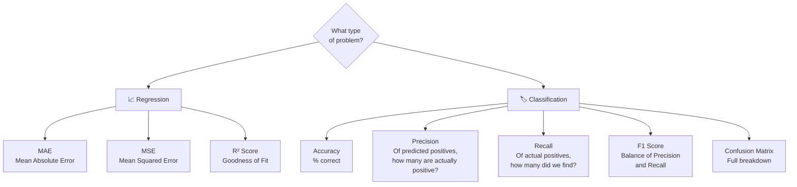

```python
from sklearn.metrics import (
    accuracy_score, precision_score, recall_score,
    f1_score, confusion_matrix, classification_report,
    mean_absolute_error, mean_squared_error, r2_score
)
import numpy as np

# ══════════════════════════════════════════
# CLASSIFICATION METRICS
# ══════════════════════════════════════════
print("=" * 50)
print("📋 CLASSIFICATION METRICS")
print("=" * 50)

# Example: Tumor detection (0=Benign, 1=Malignant)
y_true = np.array([1, 0, 1, 1, 0, 1, 0, 0, 1, 0])
y_pred = np.array([1, 0, 1, 0, 0, 1, 1, 0, 1, 0])  # Made 2 mistakes

accuracy  = accuracy_score(y_true, y_pred)
precision = precision_score(y_true, y_pred)
recall    = recall_score(y_true, y_pred)
f1        = f1_score(y_true, y_pred)

print(f"\n✅ Accuracy:  {accuracy:.2%}  (overall % correct)")
print(f"🎯 Precision: {precision:.2%} (of predicted sick, how many were actually sick)")
print(f"🔍 Recall:    {recall:.2%}  (of actually sick, how many did we catch)")
print(f"⚖️  F1 Score:  {f1:.2%}  (balance of precision + recall)")

print("\n📊 Confusion Matrix:")
cm = confusion_matrix(y_true, y_pred)
print(f"""
              Predicted
              Benign  Malignant
Actual  Benign  [ {cm[0,0]}  ,   {cm[0,1]}  ]
       Malign  [ {cm[1,0]}  ,   {cm[1,1]}  ]
""")

# ══════════════════════════════════════════
# REGRESSION METRICS
# ══════════════════════════════════════════
print("=" * 50)
print("📈 REGRESSION METRICS")
print("=" * 50)

y_true_reg = np.array([100, 200, 300, 400, 500])
y_pred_reg = np.array([110, 190, 310, 380, 520])

mae = mean_absolute_error(y_true_reg, y_pred_reg)
mse = mean_squared_error(y_true_reg, y_pred_reg)
r2  = r2_score(y_true_reg, y_pred_reg)

print(f"\n📏 MAE (Mean Absolute Error): {mae:.2f}  (avg error)")
print(f"📐 MSE (Mean Squared Error):  {mse:.2f}  (penalizes big errors)")
print(f"🎯 R² Score:                  {r2:.4f} (1.0 = perfect)")
```

---

## 17. Cross-Validation

> 💡 **Problem:** What if you're unlucky with your train/test split? Use **Cross-Validation** to get a more reliable accuracy score!

```
5-Fold Cross Validation:

Fold 1: [TEST ][train][train][train][train] → Score 1
Fold 2: [train][TEST ][train][train][train] → Score 2
Fold 3: [train][train][TEST ][train][train] → Score 3
Fold 4: [train][train][train][TEST ][train] → Score 4
Fold 5: [train][train][train][train][TEST ] → Score 5

Final Score = Average(Score1, 2, 3, 4, 5) ± std deviation
```

```python
from sklearn.model_selection import cross_val_score, StratifiedKFold
from sklearn.ensemble import RandomForestClassifier
from sklearn.datasets import load_iris
import numpy as np

iris = load_iris()
X, y = iris.data, iris.target

model = RandomForestClassifier(n_estimators=100, random_state=42)

# ─── Simple Cross Validation ───
cv_scores = cross_val_score(
    model, X, y,
    cv=5,              # 5 folds
    scoring='accuracy'
)

print("🔁 5-Fold Cross Validation Results:")
for i, score in enumerate(cv_scores, 1):
    bar = "█" * int(score * 30)
    print(f"  Fold {i}: {score:.2%} {bar}")

print(f"\n📊 Summary:")
print(f"  Mean Accuracy:  {cv_scores.mean():.2%}")
print(f"  Std Deviation:  ±{cv_scores.std():.2%}")
print(f"  Range:          {cv_scores.min():.2%} – {cv_scores.max():.2%}")

# ─── Stratified K-Fold (better for imbalanced data) ───
skf = StratifiedKFold(n_splits=5, shuffle=True, random_state=42)
strat_scores = cross_val_score(model, X, y, cv=skf, scoring='accuracy')
print(f"\n🎯 Stratified CV Mean: {strat_scores.mean():.2%}")
```

**Output:**
```
🔁 5-Fold Cross Validation Results:
  Fold 1: 100.00% ██████████████████████████████
  Fold 2: 96.67%  █████████████████████████████
  Fold 3: 93.33%  ████████████████████████████
  Fold 4: 96.67%  █████████████████████████████
  Fold 5: 100.00% ██████████████████████████████

📊 Summary:
  Mean Accuracy:  97.33%
  Std Deviation:  ±2.49%
  Range:          93.33% – 100.00%
```

---

## 18. Hyperparameter Tuning

> 💡 **Hyperparameters** are settings you choose **before** training (like `n_estimators` in Random Forest). Tuning finds the best settings automatically!

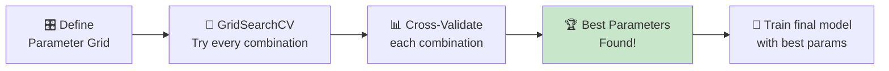

```python
from sklearn.model_selection import GridSearchCV, RandomizedSearchCV
from sklearn.ensemble import RandomForestClassifier
from sklearn.datasets import load_iris
import numpy as np

iris = load_iris()
X, y = iris.data, iris.target

# ─── Method 1: GridSearchCV (tries EVERY combination) ───
param_grid = {
    'n_estimators': [50, 100, 200],     # 3 options
    'max_depth':    [None, 3, 5, 10],   # 4 options
    'min_samples_split': [2, 5],        # 2 options
}
# Total combinations = 3 × 4 × 2 = 24, each with 5-fold CV = 120 fits!

grid_search = GridSearchCV(
    RandomForestClassifier(random_state=42),
    param_grid,
    cv=5,
    scoring='accuracy',
    verbose=1
)
grid_search.fit(X, y)

print(f"🏆 Best Parameters: {grid_search.best_params_}")
print(f"🎯 Best CV Score:   {grid_search.best_score_:.2%}")

# ─── Method 2: RandomizedSearchCV (faster — samples random combos) ───
from scipy.stats import randint

param_distributions = {
    'n_estimators': randint(50, 500),
    'max_depth':    randint(1, 20),
    'min_samples_split': randint(2, 10)
}

random_search = RandomizedSearchCV(
    RandomForestClassifier(random_state=42),
    param_distributions,
    n_iter=20,    # Try only 20 random combinations
    cv=5,
    scoring='accuracy',
    random_state=42
)
random_search.fit(X, y)
print(f"\n⚡ RandomSearch Best Params: {random_search.best_params_}")
print(f"⚡ RandomSearch Best Score:  {random_search.best_score_:.2%}")
```

---

## 19. Pipelines

> 💡 **The Problem:** You must apply the **same preprocessing** to train AND test data. Pipelines automate this and prevent data leakage!

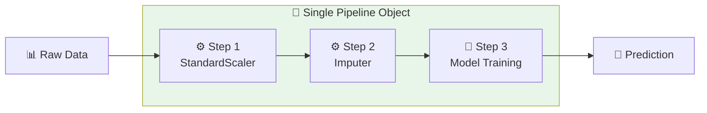

```python
from sklearn.pipeline import Pipeline
from sklearn.preprocessing import StandardScaler
from sklearn.impute import SimpleImputer
from sklearn.ensemble import RandomForestClassifier
from sklearn.datasets import load_breast_cancer
from sklearn.model_selection import train_test_split, cross_val_score
from sklearn.metrics import accuracy_score
import numpy as np

data = load_breast_cancer()
X, y = data.data, data.target

# Inject some missing values to simulate real-world data
np.random.seed(42)
X_with_nan = X.copy().astype(float)
X_with_nan.ravel()[np.random.choice(X_with_nan.size, 50, replace=False)] = np.nan

X_train, X_test, y_train, y_test = train_test_split(
    X_with_nan, y, test_size=0.2, random_state=42
)

# ─── Build the Pipeline ───
pipeline = Pipeline(steps=[
    ('imputer', SimpleImputer(strategy='median')),   # Step 1: Fill missing values
    ('scaler',  StandardScaler()),                    # Step 2: Scale features
    ('model',   RandomForestClassifier(n_estimators=100, random_state=42))  # Step 3: Train
])

# ─── Train (all steps happen automatically) ───
pipeline.fit(X_train, y_train)

# ─── Predict (preprocessing applied automatically to test data!) ───
y_pred = pipeline.predict(X_test)
accuracy = accuracy_score(y_test, y_pred)
print(f"🔗 Pipeline Accuracy: {accuracy:.2%}")

# Cross-validate the whole pipeline
cv_scores = cross_val_score(pipeline, X_with_nan, y, cv=5)
print(f"🔁 CV Mean Accuracy: {cv_scores.mean():.2%} ± {cv_scores.std():.2%}")

# Use pipeline for new predictions
print(f"\n🚀 Pipeline is ready for production!")
print(f"   Steps: {[step[0] for step in pipeline.steps]}")
```

**Output:**
```
🔗 Pipeline Accuracy: 96.49%
🔁 CV Mean Accuracy: 96.66% ± 1.35%

🚀 Pipeline is ready for production!
   Steps: ['imputer', 'scaler', 'model']
```

---

## 20. Clustering: K-Means (Unsupervised Learning)

**Use case:** Grouping data when you have **no labels** — finding hidden patterns!

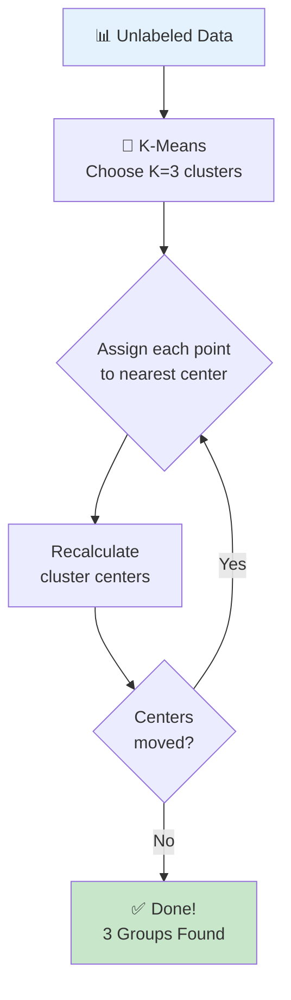

```python
from sklearn.cluster import KMeans
from sklearn.datasets import make_blobs
from sklearn.metrics import silhouette_score
import numpy as np

# Generate unlabeled blob data
X, _ = make_blobs(n_samples=300, centers=4, cluster_std=0.8, random_state=42)

# ─── Find optimal K using Elbow Method ───
print("🔍 Finding optimal number of clusters (Elbow Method):\n")
inertias = []
sil_scores = []
K_range = range(2, 9)

for k in K_range:
    kmeans = KMeans(n_clusters=k, random_state=42, n_init='auto')
    kmeans.fit(X)
    inertias.append(kmeans.inertia_)
    sil_scores.append(silhouette_score(X, kmeans.labels_))
    
    bar_inertia = "█" * int(kmeans.inertia_ / 5000)
    print(f"  K={k}: Inertia={kmeans.inertia_:,.0f} | Silhouette={sil_scores[-1]:.3f}")

# ─── Train with best K ───
best_k = K_range[np.argmax(sil_scores)]
print(f"\n🏆 Best K = {best_k} (highest silhouette score)")

kmeans = KMeans(n_clusters=best_k, random_state=42, n_init='auto')
kmeans.fit(X)

labels = kmeans.labels_
centers = kmeans.cluster_centers_

print(f"\n📊 Cluster Summary:")
for i in range(best_k):
    count = (labels == i).sum()
    print(f"  Cluster {i}: {count} points  (center: {centers[i].round(2)})")

# Predict which cluster a new point belongs to
new_point = np.array([[2.0, 3.0]])
cluster = kmeans.predict(new_point)
print(f"\n🔮 New point {new_point[0]} → Cluster {cluster[0]}")
```

**Output:**
```
🔍 Finding optimal number of clusters:

  K=2: Inertia=1,847  | Silhouette=0.612
  K=3: Inertia=1,103  | Silhouette=0.711
  K=4: Inertia=418    | Silhouette=0.843
  K=5: Inertia=378    | Silhouette=0.810

🏆 Best K = 4 (highest silhouette score)

📊 Cluster Summary:
  Cluster 0: 75 points  (center: [ 6.15 -8.24])
  Cluster 1: 76 points  (center: [-3.21  9.88])
  Cluster 2: 74 points  (center: [-5.12 -7.34])
  Cluster 3: 75 points  (center: [ 8.73  4.11])
```

---

## 🗺️ Complete ML Learning Roadmap

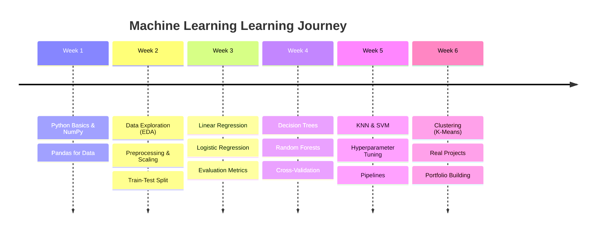

---

## 📊 Algorithm Cheat Sheet

| Algorithm | Type | Best For | Key Parameter |
|-----------|------|----------|---------------|
| Linear Regression | Regression | Continuous predictions | - |
| Logistic Regression | Classification | Binary/multi-class | `C` (regularization) |
| Decision Tree | Both | Interpretable models | `max_depth` |
| Random Forest | Both | High accuracy | `n_estimators` |
| KNN | Both | Small datasets | `n_neighbors` (K) |
| SVM | Both | High-dimensional data | `kernel`, `C` |
| K-Means | Clustering | Unsupervised grouping | `n_clusters` (K) |

---

## 🔧 Quick Reference: The 4-Step Pattern

Every scikit-learn model follows the **same 4 steps**:

```python
# 1. CREATE the model
model = SomeAlgorithm(hyperparameters)

# 2. TRAIN on training data
model.fit(X_train, y_train)

# 3. PREDICT on test/new data
y_pred = model.predict(X_test)

# 4. EVALUATE performance
score = accuracy_score(y_test, y_pred)  # or r2_score for regression
```

---

## 🚀 Next Steps

1. **Practice** — Try Kaggle's beginner competitions
2. **Projects** — Build a spam detector, house price predictor, or image classifier
3. **Deep Learning** — Explore TensorFlow/PyTorch after mastering sklearn
4. **Resources:**
   - 📖 [Scikit-learn Docs](https://scikit-learn.org/stable/user_guide.html)
   - 🎓 [Kaggle Learn ML](https://www.kaggle.com/learn/intro-to-machine-learning)
   - 📚 [Hands-On ML Book (Géron)](https://github.com/ageron/handson-ml3)

---

*📝 Created for absolute beginners | scikit-learn v1.4+ | Python 3.9+*
